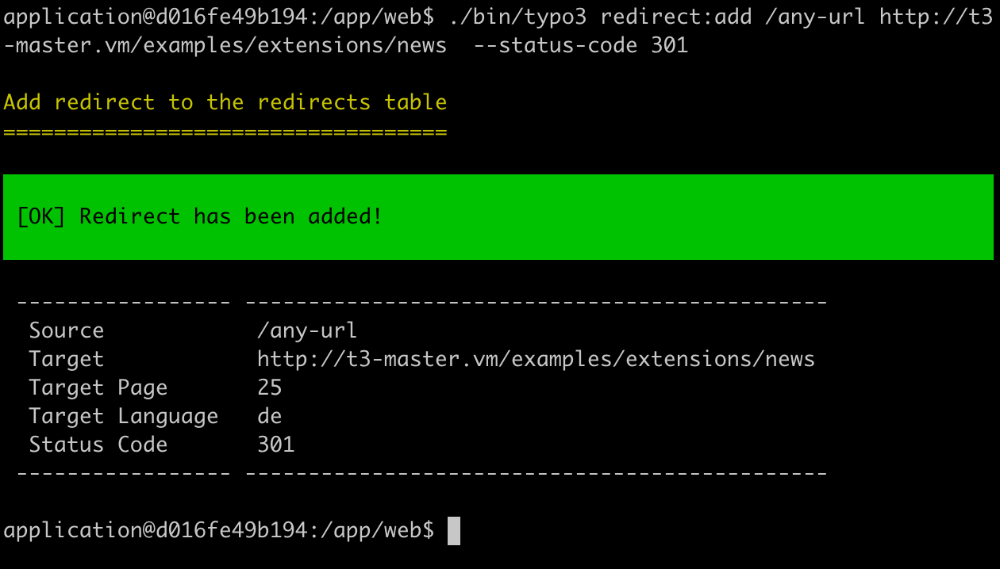

# TYPO3 Extension `redirect_generator`

This extensions creates proper redirect entries from a CSV file.

Each target entry will be matched by the routing configuration. If the target is `http://demo.vm/company/contact`, the redirect will be created to the related page id!



## Installation

### Requirements

* TYPO3 10 / 11
* EXT:redirects

### Setup

Install as any other extension:

* *Composer*: `composer require georgringer/redirect-generator`

## Configuration

Set the following extension configuration options to enable email notifications:

* *notification_email*: A comma separated list of e-mail addresses to send notification emails of the export and import commands
* *notification_level*: Set the level of notification messages you want to receive:
  * 0 (error): Only receive error messages
  * 1 (warning): Receive error and warning messages
  * 2 (info): Receive all messages
* *allow_empty_import_file*: If true an empty CSV file will silently skip the import, otherwise an error is thrown

## Usage

### Add single redirect

Use the following CLI command:

```bash
./bin/typo3 redirect:add /any-url https://domain.tld/your-final-url
```

The following options are available:

* `--status-code`: Define the status code, allowed are *301*,*302*, *303* and *307*.
* `--dry-run`: If set, the redirect won't be added

### Import CSV

Use the following CLI command:

```bash
./bin/typo3 redirect:import <path-to-file.csv>
```

````csv
source;target;status_code
/fo/bar;http://t3-master.vm/examples/extensions/news;301
/fo/bar2;http://t3-master.vm/examples/extensions/news;307
/fo/bar3;http://t3-master.vm/exakqwkqkwmples/extensions/news;301
````

A sample CSV file can be found at `EXT:redirect_generator/Resources/Private/Examples/ImportBasic.csv`

In addition an additional column `external` can be added to the CSV. It can be 0 (false) or 1 (true). If 1, the target is interpreted as an external URL and not mapped against a TYPO3 page.

The following options are available:

* `--dry-run`: If set, the redirect won't be added
* `--external-domains`: Provide a comma separated list of domains which are external
* `--delete-file`: If set the CSV file is deleted after (a successful or unsuccessful) import

> This command can be run in the scheduler (select *Execute console commands* as class)

### Export Redirects

Export all redirects as CSV.
The optional option `--transform-target-url` transform the target url like `t3://page?uid=1106` into the final URL.

Use the following CLI command:

```bash
./bin/typo3 redirect:export export.csv --transform-target-url
```

> This command can be run in the scheduler (select *Execute console commands* as class)
