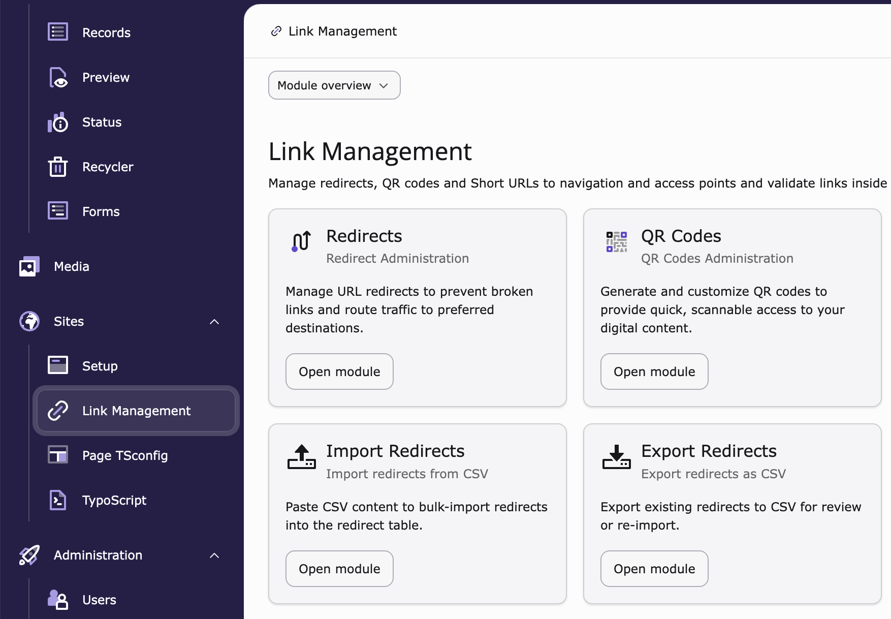
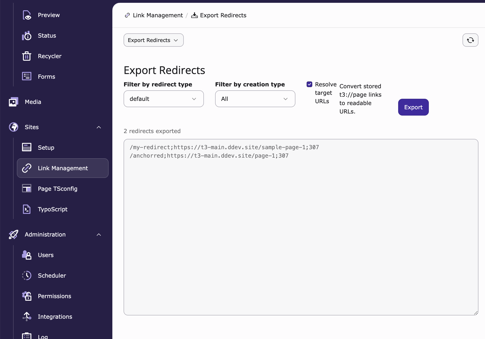
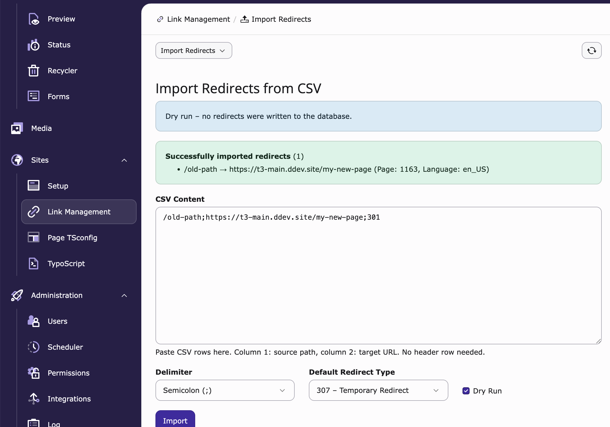
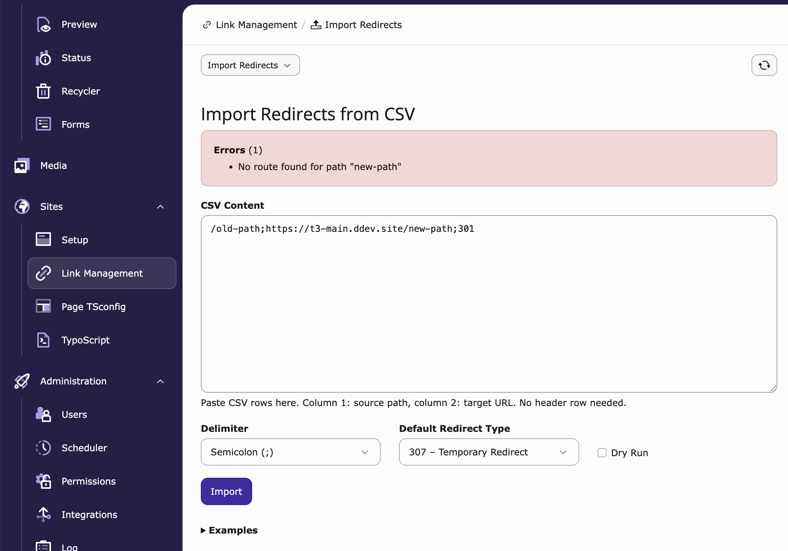

# TYPO3 Extension `redirect_generator`

CLI tools and backend modules to bulk-import and export TYPO3 redirects from/to CSV.

Target URLs are automatically resolved to `t3://page?uid=X` links via TYPO3's routing - no manual page ID lookup needed,
including error check.

## Requirements

- TYPO3 13.4 LTS or 14 LTS
- EXT:redirects

## Installation

```bash
composer require georgringer/redirect-generator
```

## Configuration

Extension configuration options (Admin → Settings → Extension Configuration):

| Option | Description |
|---|---|
| `notification_email` | Comma-separated list of addresses for import/export notifications |
| `notification_level` | `0` = errors only · `1` = + warnings · `2` = + info |
| `allow_empty_import_file` | If true, an empty CSV file silently skips the import instead of throwing an error |

## CLI Commands

### Add a single redirect

```bash
./bin/typo3 redirect:add <source> <target> [--status-code=307] [--dry-run]
```

The target must be a full URL of a page on this TYPO3 instance. It is resolved to the corresponding page ID automatically.

```bash
./bin/typo3 redirect:add /old-path https://example.com/new-page --status-code=301
```

### Import redirects from CSV

```bash
./bin/typo3 redirect:import <file.csv> [--dry-run] [--external-domains=domain1,domain2] [--delete-file]
```

**CSV format** — semicolon-delimited, first row must be the header:

```csv
source;target;status_code;external
/old-page;https://example.com/new-page;301;0
/old-section/article;https://example.com/news/article;307;0
/external-link;https://other-domain.com/page;301;1
```

| Column | Required | Description |
|---|---|---|
| `source` | yes | Source path (e.g. `/old-page`) |
| `target` | yes | Full target URL. Internal pages are resolved to `t3://page?uid=X`. Set `external=1` to skip resolution. |
| `status_code` | no | HTTP status code. Falls back to `307` if omitted or invalid. |
| `external` | no | `1` = store target URL as-is without page lookup |

Set a target value of `x` to skip a row.

Options:

| Option | Description |
|---|---|
| `--dry-run` | Simulate import without writing to the database |
| `--delimiter` | CSV delimiter: `;` (default), `,` or `tab` |
| `--external-domains` | Comma-separated list of domains always treated as external |
| `--delete-file` | Delete the CSV file after import |

> This command is schedulable (TYPO3 Scheduler → *Execute console commands*).

### Export redirects to CSV

```bash
./bin/typo3 redirect:export <output.csv> [--transform-target-url]
```

`--transform-target-url` resolves stored `t3://page?uid=X` links back to readable URLs.

> This command is schedulable.

## Backend UI — `redirect_generator_ui`

The companion extension **`georgringer/redirect-generator-ui`** adds a full backend module under *Link Management* with import and export forms — no CLI access required.

More information: [ringer.it/extensions/redirect-generator-ui](https://ringer.it/extensions/redirect-generator-ui/)

```bash
composer require georgringer/redirect-generator-ui
```

<table>
  <tr>
    <td align="center" width="50%">
      <br/>
      <sub>Module in the backend navigation</sub>
    </td>
    <td align="center" width="50%">
      <br/>
      <sub>Export — filter by type, resolve target URLs</sub>
    </td>
  </tr>
  <tr>
    <td align="center" width="50%">
      <br/>
      <sub>Import — live result with per-row feedback</sub>
    </td>
    <td align="center" width="50%">
      <br/>
      <sub>Import — conflicts and errors shown inline</sub>
    </td>
  </tr>
</table>

**Features:**

- Paste CSV directly into a textarea — no file upload or server access needed
- Choose delimiter (`;` `,` `tab`) and default status code per import run
- Dry-run mode to preview results before writing
- Per-row result feedback: imported, skipped, conflicting duplicates, errors
- Export with optional filter by redirect type or creation type
- Resolve stored `t3://page` links to readable URLs on export

## PSR-14 Events

Two events are dispatched from `RedirectRepository::addRedirect()` (not fired during dry runs):

### `BeforeRedirectAddedEvent`

Fired just before the database insert. Listeners may modify source URL, target URL, or the `Configuration` object.

```php
use GeorgRinger\RedirectGenerator\Event\BeforeRedirectAddedEvent;

class MyListener
{
    public function __invoke(BeforeRedirectAddedEvent $event): void
    {
        // Force all new redirects to 301
        $event->setConfiguration(
            new Configuration(targetStatusCode: 301)
        );
    }
}
```

### `AfterRedirectAddedEvent`

Fired after the insert. Provides `sourceUrl`, `targetUrl`, `configuration`, and the new `uid`.

```php
use GeorgRinger\RedirectGenerator\Event\AfterRedirectAddedEvent;

class MyListener
{
    public function __invoke(AfterRedirectAddedEvent $event): void
    {
        // e.g. flush a custom cache, send a webhook, ...
    }
}
```

Register listeners in your extension's `Services.yaml`:

